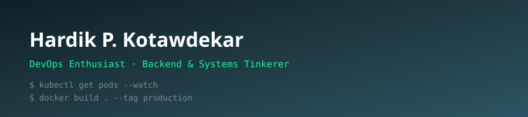

<div align="center">



</div>

<br/>

### 🧭 `whoami`

```yaml
name: Hardik P. Kotawdekar
role: CS Student | DevOps & Backend Enthusiast
focus:
  - Building and shipping full-stack + backend projects
  - Automating everything that can be automated
  - Breaking things on purpose to understand them (BLE reverse engineering 👀)
currently_learning: Docker, Kubernetes, CI/CD pipelines, Cloud infra
fun_fact: "Touch some grass, it helps."
```

<br/>

## ⚙️ Tech & Tools

<div align="center">


</div>

<br/>

## 📊 Pipeline Stats

<div align="center">

<!--
  Generated by this repo's own GitHub Action (.github/workflows/metrics.yml).
  Runs on your own compute and commits metrics.svg back to this repo, so it
  doesn't depend on a shared free third-party service that can go down.
-->


</div>

<br/>

## 🚀 Featured Deployments

- 🧩 **[QuizVerse](https://github.com/Hardyik/QuizVerse)** — Full-stack Flask quiz app, JWT auth, admin system, deployed on Render (PostgreSQL + gunicorn).
- 💬 **[Ops-Mind-Chat-App](https://github.com/Hardyik/Ops-Mind-Chat-App)** — Chatbot that parses and answers questions on company privacy policy docs.
- 🛡️ **[ApexPlanet-cybersecurity-internship](https://github.com/Hardyik/ApexPlanet-cybersecurity-internship)** — 60-day cybersecurity & ethical hacking internship: Kali Linux, Nmap, Metasploit, Wireshark, OWASP Top 10.

<br/>

## 🔗 Connect

<div align="center">

[](mailto:hardik.k.1310@gmail.com)
[](https://github.com/Hardyik)

</div>
